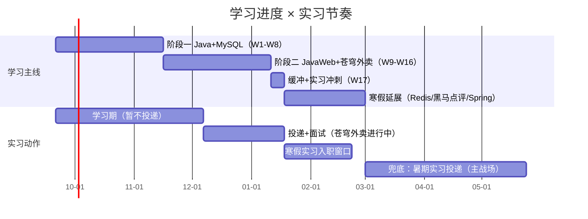
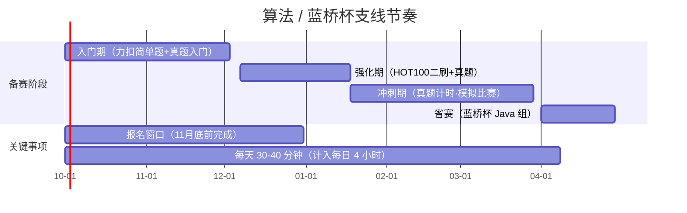

# learning

后端 Java 学习计划（4 个月 · 2026-09-21 → 2027-01-17 · 每日约 4 小时）
目标：大二寒假 Java 后端实习 + 2027 蓝桥杯（Java 组）

## 计划总览

| 阶段 | 周次 | 内容 |
| --- | --- | --- |
| 阶段一：Java + MySQL 夯实 | W1–W8 | W1-W2 巩固周（非零基础，自查+刷题）→ 集合/IO/多线程 → MySQL 基础+进阶 → JDBC/Maven/综合项目 → 复盘+首版简历 |
| 阶段二：JavaWeb + 苍穹外卖 | W9–W16 | 前端基础/HTTP → Servlet/Filter/AJAX → MyBatis/Spring/SpringBoot → 苍穹外卖全流程 → 文档/简历/面试 |
| 缓冲 + 实习冲刺 | W17 | 补进度 / 面试冲刺 / 蓝桥杯强化 / 入职准备 |
| Agent 平行支线 | 每周日 4h | 概念 → 提示词 → Java 调 LLM → Function Calling → SpringBoot 智能客服 → 苍穹外卖 AI 功能 |
| 算法/蓝桥杯支线 | 每天 30-40 分钟 | 力扣 HOT100 + 蓝桥杯真题（Java）；报名 10-12 月；省赛 2027 年 4 月 |
| 寒假延展（主线之外） | 2027-01 起 | Redis（含黑马点评）→ Spring 深入 → Agent 深化（Spring AI/RAG）+ 蓝桥杯冲刺 |

## 计划节奏（图）

> 学习主线与实习动作对照（GitHub Mermaid 甘特图渲染）

> 算法 / 蓝桥杯支线节奏（每天 30-40 分钟，计入每日 4 小时）

## 课程来源

全部为哔哩哔哩「黑马程序员」系列课程：

- Java：Java 零基础视频教程（上/下部）
- MySQL：MySQL 数据库入门到精通（基础篇+进阶篇）
- JavaWeb：JavaWeb 开发教程（https://www.bilibili.com/video/BV1m84y1w7Tb）
- 项目：苍穹外卖项目实战（https://www.bilibili.com/video/BV1FSvde6EBs）
- 寒假：Redis 入门到实战（https://www.bilibili.com/video/BV1cr4y1671t）、SSM 框架教程
- 黑马主页：https://space.bilibili.com/37974444

## 算法 / 蓝桥杯支线（每天 30-40 分钟，计入每日 4 小时）

- 平台：力扣（https://leetcode.cn，HOT 100 题单）、蓝桥杯题库（https://dasai.lanqiao.cn，按年份刷真题，Java 提交）
- 节奏：W1-W2 简单题入门 → W3-W7 数据结构主题刷题（与课程同步）→ W8-W17 真题 + HOT100 强化 → 寒假 + 3 月冲刺 → 4 月省赛
- 报名：蓝桥杯报名窗口通常在 10-12 月，务必 11 月底前完成（留意 dasai.lanqiao.cn 通知）

## 实习目标与节奏

- W12（12 月上旬）起正式投递「日常实习」（BOSS直聘/牛客/实习僧），目标中小厂/创业团队；11 月起先关注岗位、完善渠道
- 12 月为投递+面试高峰 → 1 月中苍穹外卖完成 → 1 月下旬-2 月寒假实习入职
- 兜底：若寒假未成行，2027 年 3-5 月投递大三暑期实习（主战场），本计划即为铺垫

## 目录结构

- study/plans/：每周计划 week1–week17
- study/plans/algorithm/：力扣 + 蓝桥杯刷题代码
- study/plans/c-practice/：早期 C 语言数据结构练习
